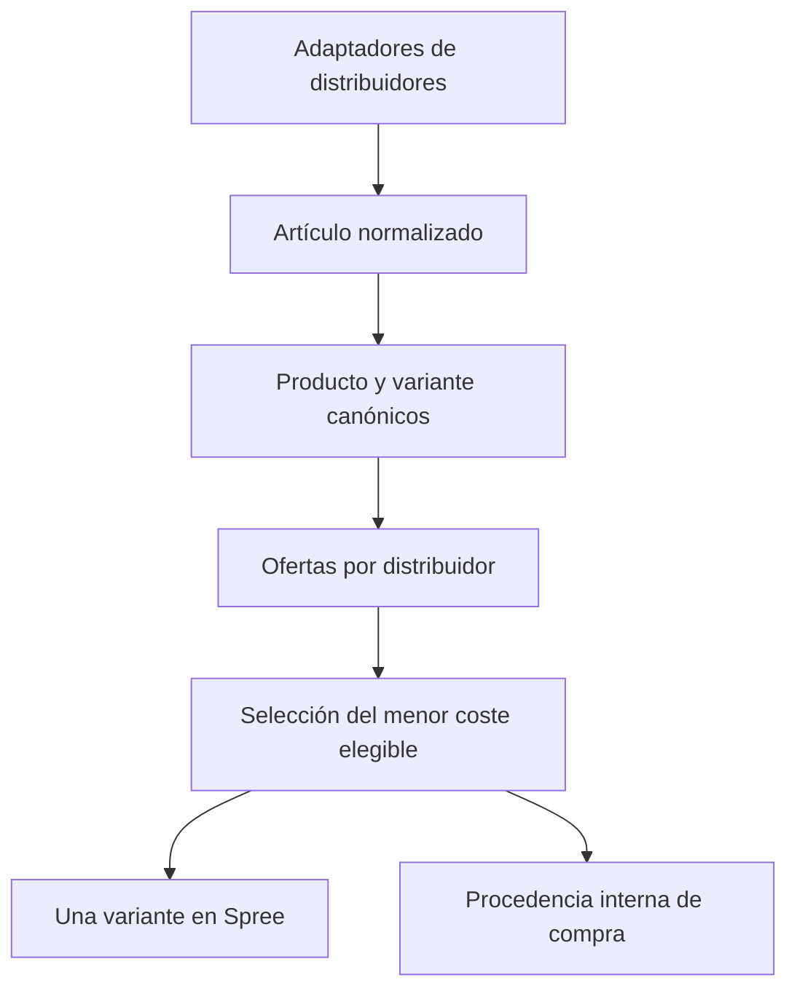

# Catálogo multidistribuidor

El catálogo separa la identidad comercial de Spree de las ofertas de compra. Un
producto/variante existe una sola vez; cada distribuidor aporta una oferta para
esa variante y el worker selecciona la oferta elegible de menor coste.



Stripe y el checkout no cambian. Spree sigue siendo la fuente de verdad para
producto, variante, PVP, inventario, carrito y pedido. Supabase conserva las
identidades, costes y procedencia de aprovisionamiento.

## Modelo de datos

La migración
`supabase/migrations/20260920193000_catalog_sourcing.sql` crea:

| Tabla o vista | Responsabilidad |
| --- | --- |
| `catalog_suppliers` | Registro y prioridad de N distribuidores; nunca guarda secretos. |
| `catalog_products` | Producto canónico y su `spree_product_id`. |
| `catalog_variants` | Variante canónica, opciones, SKU estable, oferta seleccionada y `spree_variant_id`. |
| `catalog_variant_identifiers` | EAN/GTIN, ISBN, referencia de fabricante y alias por distribuidor. |
| `catalog_supplier_offers` | Coste, disponibilidad, stock, URL y payload de cada distribuidor. |
| `catalog_offer_selection_history` | Historial auditable de cambios de proveedor. |
| `catalog_selected_supply` | Vista interna: dónde comprar cada variante ahora mismo. |

Todas las tablas tienen RLS, no conceden acceso a `anon` ni `authenticated` y
son operadas por la Edge Function con service role. Las credenciales de cada
adaptador deben vivir en Supabase Vault o en secretos de la función, nunca en
`catalog_suppliers.config`.

La migración conserva los IDs existentes de Spree y convierte
`devir_sync_catalog` en productos, variantes y ofertas Devir. Es idempotente y
no crea productos nuevos en Spree durante el backfill.

## Identidad y deduplicación

El orden de matching es deliberadamente conservador:

1. Oferta ya conocida por `(supplier_id, external_variant_id)`.
2. GTIN/EAN o ISBN válido.
3. Referencia de fabricante con fabricante explícito.
4. Grupo exacto y firma de opciones exacta.
5. Título normalizado, categoría y opciones exactos.

El SKU de un distribuidor sólo es único dentro de ese distribuidor. Nunca se
usa como identidad global salvo que sea un GTIN/ISBN válido. Esto evita que dos
mayoristas que reutilicen `ABC-123` mezclen productos distintos.

El fallback por título no es fuzzy: exige igualdad normalizada y queda marcado
para revisión. Si dos fuentes nombran el mismo artículo de forma diferente y no
aportan EAN/ISBN/referencia de fabricante, se debe añadir un alias a
`catalog_variant_identifiers`; no se fusionan automáticamente por semejanza.

### Variantes

Cada adaptador debe enviar el nombre de la familia en `productName` y las
dimensiones reales de variante en `options`, por ejemplo:

```json
{
  "productName": "Frieren",
  "variantName": "Tomo 02 · Edición especial",
  "groupKey": "frieren",
  "options": {
    "tomo": "02",
    "edicion": "Especial",
    "idioma": "Español"
  }
}
```

El orden de las claves no afecta a la identidad. Dos tomos, idiomas, tamaños o
ediciones permanecen como variantes distintas; las ofertas equivalentes de
varios distribuidores convergen en la misma variante.

Las acciones heredadas `regroup` y `regroup-language` quedan deshabilitadas:
recreaban productos directamente en Spree y sólo reparaban el índice de Devir.
Los nuevos agrupados deben salir del adaptador con `productName` y `options`;
así pasan por la identidad canónica y no rompen los mappings multidistribuidor.

## Regla de selección

La oferta seleccionada es la de menor `normalizedCost` en EUR que cumpla todo:

- distribuidor habilitado;
- oferta activa y vista dentro de `staleAfterHours`;
- estado `available` o `preorder`;
- coste positivo y comparable;
- moneda EUR.

`normalizedCost` es el coste neto puesto en almacén: compra más transporte y
otros costes atribuibles. Si el proveedor informa un precio con IVA, el
adaptador debe aportar `taxRate` o calcular explícitamente `normalizedCost`. El
worker no compara importes brutos y netos como si fueran equivalentes.

Los empates se resuelven por disponibilidad (`available` antes de `preorder`),
prioridad del distribuidor, código, SKU e ID. El resultado es determinista y no
oscila entre ciclos.

La reconciliación usa un lock breve por producto canónico. Si dos adaptadores descubren
el mismo GTIN a la vez, ambos pueden registrar su oferta, pero sólo uno crea o
actualiza la variante de Spree; el segundo recarga ese mapping antes de seguir.

Cuando una oferta desaparece de dos crawls completos se desactiva. El worker
vuelve a seleccionar inmediatamente: si existe un segundo proveedor válido,
Spree continúa vendiendo contra ese proveedor; si no existe, se desactiva el
backorder del proveedor sin modificar el stock físico.

Cada tick del worker revisa además un lote de selecciones caducadas o de
distribuidores deshabilitados. Por tanto, un adaptador que falle antes de poder
cerrar su run no deja stock de proveedor vendible indefinidamente.

## PVP y pagos

La selección elige el coste de aprovisionamiento, no copia un PVP del
distribuidor. El PVP se vuelve a calcular con las reglas existentes de margen,
IVA y coste estándar de Stripe. Se mantienen las protecciones actuales:

- no se sobrescribe el PVP de un producto activo;
- no se sobrescribe un PVP editado manualmente;
- los productos nuevos nacen como `draft`;
- Stripe, checkout, clientes y pedidos no se modifican.

El `cost_price` de la variante sí refleja el coste normalizado del proveedor
seleccionado, para que administración y márgenes utilicen la fuente correcta.

## Procedencia interna

La procedencia se puede consultar de dos formas:

1. Supabase: vista `catalog_selected_supply`, con distribuidor, SKU de compra,
   coste, disponibilidad y URL.
2. Spree Admin: custom field privado
   `sourcing.variant_provenance`, con una entrada por `spree_variant_id`, la
   oferta elegida y las demás ofertas observadas.

El campo se crea con `storefront_visible: false`; no se expone en Store API. El
historial completo queda en `catalog_offer_selection_history`.

## Contrato de un adaptador

Un adaptador sólo autentica/lee al distribuidor y transforma cada variante al
contrato siguiente. No contiene reglas de deduplicación, Spree ni Stripe.

```json
{
  "externalProductId": "supplier-product-42",
  "externalVariantId": "supplier-variant-42-red",
  "supplierSku": "ABC-42-R",
  "productName": "Caja coleccionista",
  "variantName": "Roja XL",
  "sourceUrl": "https://b2b.example/products/42",
  "categoryKey": "accesorios",
  "gtin": "08412345678905",
  "manufacturer": "Fabricante",
  "manufacturerSku": "BOX-42-R",
  "options": { "color": "Rojo", "tamano": "XL" },
  "purchasePrice": 8.25,
  "shippingCost": 0.4,
  "normalizedCost": 8.65,
  "currency": "EUR",
  "taxIncluded": false,
  "referencePriceNet": 14.95,
  "availability": "available",
  "stockQuantity": 20,
  "imageUrls": ["https://cdn.example/42-red.jpg"]
}
```

Campos esenciales: `externalVariantId`, `supplierSku`, `productName`,
`purchasePrice`, `currency`, `availability` y suficientes identificadores u
opciones para reconocer la variante.

## Añadir un distribuidor

### 1. Aplicar infraestructura

Aplicar primero la migración en Supabase y después desplegar la nueva versión de
`devir-sync`. No desplegar el worker antes de la migración.

### 2. Registrar el distribuidor

Crear un JSON local no secreto:

```json
{
  "code": "mayorista_demo",
  "name": "Mayorista Demo",
  "adapterKey": "mayorista_demo_api",
  "enabled": true,
  "priority": 100,
  "defaultCurrency": "EUR",
  "staleAfterHours": 18,
  "syncIntervalHours": 6
}
```

```bash
pnpm catalog:sourcing register .local/mayorista-demo.json
```

### 3. Ejecutar un crawl completo

El adaptador genera un `runId` único, envía lotes de hasta 100 variantes y sólo
marca el run como completo después de recorrer todo el catálogo:

```bash
pnpm catalog:sourcing ingest mayorista_demo .local/lote-01.json run-20260920-1800
pnpm catalog:sourcing ingest mayorista_demo .local/lote-02.json run-20260920-1800
pnpm catalog:sourcing complete mayorista_demo run-20260920-1800
```

No ejecutar `complete` tras un crawl parcial o fallido: ese paso incrementa el
contador de artículos ausentes. Hacen falta dos runs completos sin observar una
oferta para desactivarla. Completar dos veces el mismo `runId` es idempotente y
un run ya cerrado no acepta lotes nuevos. El cierre es transaccional y bloquea
únicamente la fila del distribuidor, por lo que dos cierres simultáneos no
incrementan dos veces el contador.

### 4. Programación

El adaptador puede ejecutarse desde otra Edge Function, Vercel Cron o un proceso
externo. Cada distribuidor puede tener autenticación y paginación distintas;
todos llaman a las mismas acciones internas:

- `catalog-supplier-upsert`;
- `catalog-ingest`;
- `catalog-complete-run`;
- `catalog-sourcing-status`.

Las acciones requieren `x-spree-admin-key`; los ticks internos siguen usando el
token privado del worker. Devir ya actúa como el primer adaptador y atraviesa el
mismo pipeline genérico.

### TcgFactory

TcgFactory usa el código `tcgfactory` y el contrato
`tcgfactory_b2b_bridge_v1`. Su adaptador puro, configuración deshabilitada y
comandos de validación/ingesta ya están versionados. La cuenta y la contraseña
son secretos de backend llamados `TCGFACTORY_B2B_EMAIL` y
`TCGFACTORY_B2B_PASSWORD`; nunca pertenecen al registro del distribuidor.

No se debe habilitar hasta validar un catálogo autenticado real. La web pública
aporta referencia, EAN, disponibilidad y atributos, pero no garantiza el coste
profesional comparable. El adaptador exige explícitamente un precio B2B neto o
un precio bruto con IVA/coste normalizado y rechaza precios ambiguos.

Leer `TCGFACTORY_SYNC.md` antes de modificar este proveedor. Contiene el estado
real de la integración, el contrato de feed, los pasos para guardar secretos y
el protocolo de investigación para futuras IAs.

## Operación y diagnóstico

```bash
pnpm catalog:sourcing status
```

La respuesta muestra distribuidores y la fuente seleccionada por variante. Los
errores de un lote se devuelven por variante, de modo que un artículo mal
formado no oculta los demás resultados.

Antes de producción:

1. aplicar la migración;
2. comprobar el backfill y `catalog_selected_supply`;
3. ejecutar un lote pequeño del segundo distribuidor;
4. verificar un match por GTIN y otro por opciones;
5. confirmar en Spree que sólo existe una variante y que el custom field indica
   el proveedor más barato;
6. ejecutar el crawl completo y entonces `catalog-complete-run`.


## Política comercial de precio y ofertas

El precio automático usa perfiles comerciales por producto además de la categoría.
Los perfiles son deliberadamente más granulares para distinguir, entre otros,
booster boxes, Commander precons, bundles y sobres de MTG; sellado de otros TCG;
juegos de mesa y expansiones; rol; y familias de accesorios.

Los porcentajes del perfil son **suelos de contribución sobre el PVP final** tras
IVA y la comisión estándar de tarjeta, no markups sobre coste. Los libros de precio
fijo conservan su tratamiento específico y no participan en ofertas rotativas.

La referencia comercial actual mantiene los booster boxes de MTG con un suelo
muy competitivo (4,5 %) y eleva Commander precons al 10 %. Juegos de mesa se
sitúan alrededor de 8,5 %, expansiones en 10 % y accesorios entre 13 % y 15 %
según familia. Los precios manuales de Spree siguen teniendo prioridad.

Las ofertas públicas se implementan como una Price List de Spree separada del
precio base. Rotan una vez por día según calendario Europe/Madrid, con 8 productos
en un día normal y 16 los sábados. La selección es determinista por fecha,
diversificada por perfil y respeta un suelo de contribución específico para
ofertas. Manga/libros de precio fijo y productos en revisión quedan excluidos.
